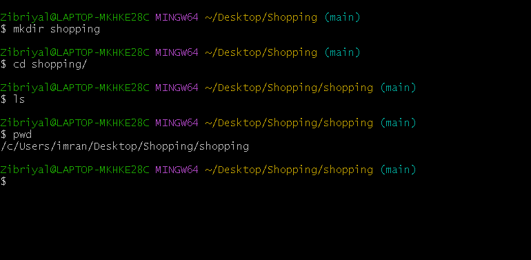
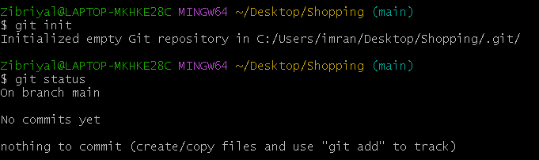
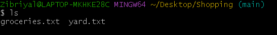
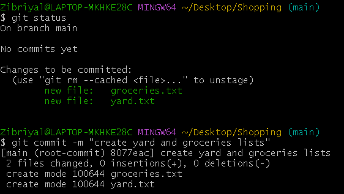
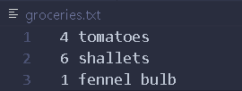
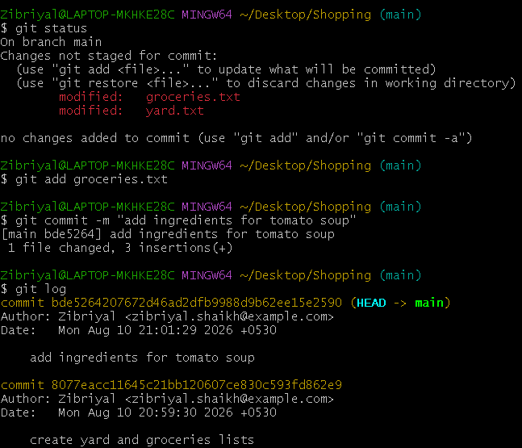
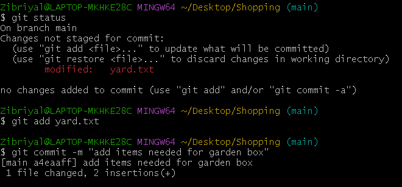
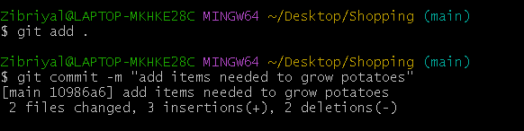
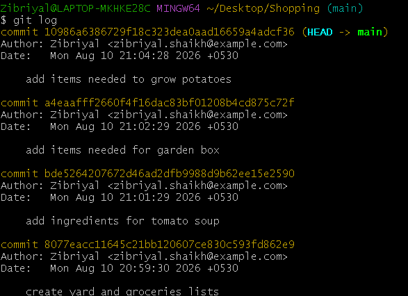

# Git Basics — Committing Exercise

This exercise covers:

* Creating a Git repository
* Creating files
* Making commits
* Committing one file at a time
* Committing multiple files
* Viewing commit history

---

## 1. Create the Project

Create a folder and move into it:

```bash
mkdir Shopping
cd Shopping
```

**Screenshot — Folder created**

> Add your screenshot here.

```text
📸 Screenshot:

```

---

## 2. Start Git

Create a Git repository:

```bash
git init
```

Check the status:

```bash
git status
```

**Screenshot — Git initialized**

> Add your screenshot here.

```text
📸 Screenshot:

```

---

## 3. Create the Files

Create two empty files:

```bash
touch yard.txt groceries.txt
```

Check:

```bash
ls
```

You should see:

```text
groceries.txt
yard.txt
```

**Screenshot — Files created**

> Add your screenshot here.

```text
📸 Screenshot:

```

---

## 4. First Commit

Add both files:

```bash
git add yard.txt groceries.txt
```

Commit them:

```bash
git commit -m "create yard and groceries lists"
```

**Commit 1**

```text
create yard and groceries lists
```

**Screenshot — First commit**

> Add your screenshot here.

```text
📸 Screenshot:

```

---

## 5. Add Shopping Lists

### `yard.txt`

```text
- 2 bags of potting soil
- 1 bag of worm castings
```

### `groceries.txt`

```text
- 4 tomatoes
- 6 shallots
- 1 fennel bulb
```

Check the changes:

```bash
git status
```

**Screenshot — Both files changed**

> Add your screenshot here.

```text
📸 Screenshot:

```

---

## 6. Commit Only `groceries.txt`

Add only the grocery file:

```bash
git add groceries.txt
```

Commit:

```bash
git commit -m "add ingredients for tomato soup"
```

**Commit 2**

```text
add ingredients for tomato soup
```

Check:

```bash
git status
```

`yard.txt` should still show as changed.

**Screenshot — Grocery commit**

> Add your screenshot here.

```text
📸 Screenshot:

```

---

## 7. Commit Only `yard.txt`

Add the yard file:

```bash
git add yard.txt
```

Commit:

```bash
git commit -m "add items needed for garden box"
```

**Commit 3**

```text
add items needed for garden box
```

**Screenshot — Yard commit**

> Add your screenshot here.

```text
📸 Screenshot:

```

---

## 8. Make More Changes

Add this line to `groceries.txt`:

```text
- couple of seed potatos
```

Change the first line of `yard.txt`:

```text
- 3 bags of potting soil
```

The files should now look like:

### `groceries.txt`

```text
- 4 tomatoes
- 6 shallots
- 1 fennel bulb
- couple of seed potatos
```

### `yard.txt`

```text
- 3 bags of potting soil
- 1 bag of worm castings
```

---

## 9. Commit Both Files

Add both files:

```bash
git add groceries.txt yard.txt
```

Commit:

```bash
git commit -m "add items needed to grow potatoes"
```

**Commit 4**

```text
add items needed to grow potatoes
```

**Screenshot — Fourth commit**

> Add your screenshot here.

```text
📸 Screenshot:

```

---

## 10. Check Your Commits

Run:

```bash
git log --oneline
```

You should have **4 commits**:

```text
xxxxxxx add items needed to grow potatoes
xxxxxxx add items needed for garden box
xxxxxxx add ingredients for tomato soup
xxxxxxx create yard and groceries lists
```

Your commit IDs will be different.

**Screenshot — Git log showing 4 commits**

> Add your screenshot here.

```text
📸 Screenshot:

```

---

# Final Result

Your project should contain:

```text
Shopping/
├── .git/
├── groceries.txt
└── yard.txt
```

And your Git history should contain:

| # | Commit                              |
| - | ----------------------------------- |
| 1 | `create yard and groceries lists`   |
| 2 | `add ingredients for tomato soup`   |
| 3 | `add items needed for garden box`   |
| 4 | `add items needed to grow potatoes` |

---

## What I Learned

* `git init` → starts Git in a folder
* `git add` → chooses files for the next save
* `git commit` → saves those changes
* `git status` → shows what changed
* `git log` → shows previous saves

### Most important idea

```text
Change files
    ↓
git add
    ↓
git commit
```

---

## 📸 Screenshot Checklist

* [ ] Folder created
* [ ] Git initialized
* [ ] Files created
* [ ] First commit
* [ ] Both files changed
* [ ] Grocery commit
* [ ] Yard commit
* [ ] Fourth commit
* [ ] `git log` showing 4 commits


