# Exercise 02 – Git Branching

This exercise demonstrates how to create a Git repository, create and switch between branches, make branch-specific changes, create a branch from another branch, and delete a branch.

---

## 1. Create a new folder called `Patronus`

Create the `Patronus` folder and move into it:

```bash
mkdir Patronus
cd Patronus
```

**Screenshot:**

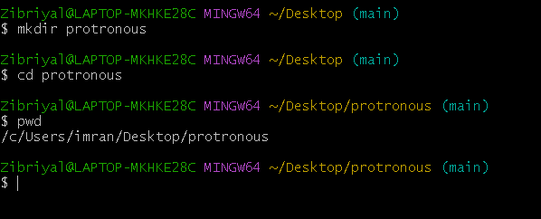

---

## 2. Initialize a new Git repository

Make sure you are inside the `Patronus` folder and **not inside an existing Git repository**.

Initialize a new repository:

```bash
git init
```

Check the repository status:

```bash
git status
```

**Screenshot:**

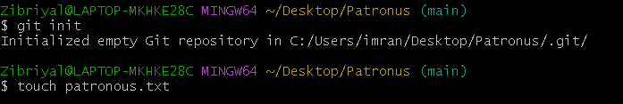

---

## 3. Create `patronus.txt`

Create an empty file named `patronus.txt`:

```bash
touch patronus.txt
```

Verify that the file exists:

```bash
ls
```

**Screenshot:**

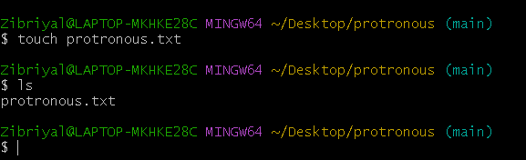

---

## 4. Add and commit the empty file

Add the empty file to the staging area:

```bash
git add patronus.txt
```

Commit it with the required message:

```bash
git commit -m "add empty patronus file"
```

**Screenshot:**

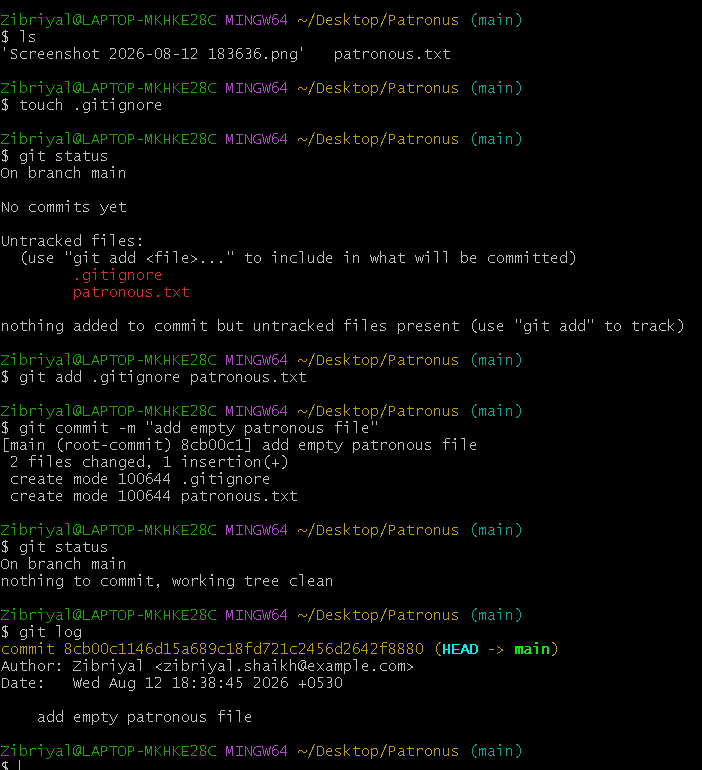

---

## 5. Create the `harry` and `snape` branches

Immediately create two branches based on the current `master` branch:

```bash
git branch harry
git branch snape
```

At this point, there should be three branches:

* `master`
* `harry`
* `snape`

**Screenshot:**

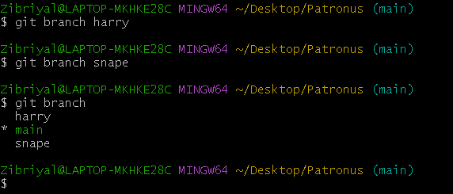

---

## 6. Move to the `harry` branch

Use the **newer** Git command, `git switch`, to change branches:

```bash
git switch harry
```

Verify the current branch:

```bash
git branch
```

The `*` should appear next to `harry`.

**Screenshot:**

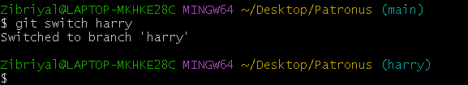

---

## 7. Add Harry's Patronus

Edit `patronus.txt` and add the required Harry content:

```text
HARRY'S PATRONUS

<add the stag ASCII-art provided in the exercise>
```

Check the file contents:

VSCODE

**Screenshot:**

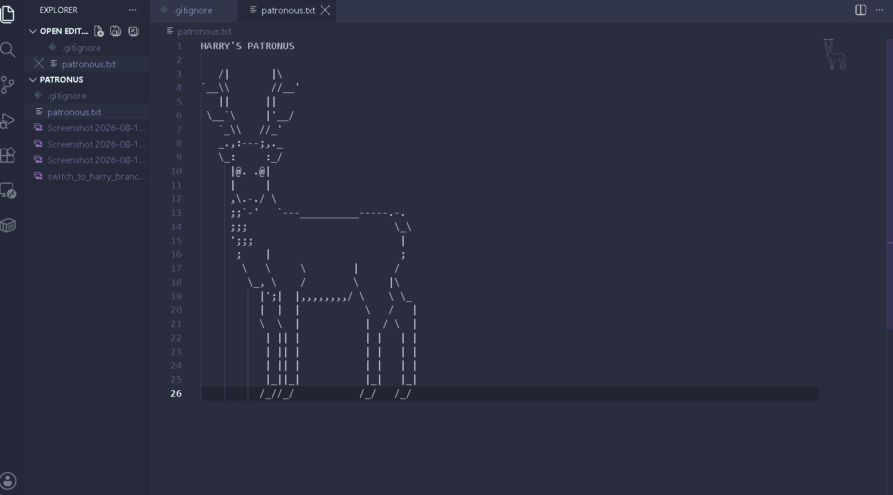

---

## 8. Commit Harry's changes

Stage the file:

```bash
git add patronus.txt
```

Commit the changes using the required commit message:

```bash
git commit -m "add harry's stag patronus"
```

**Screenshot:**

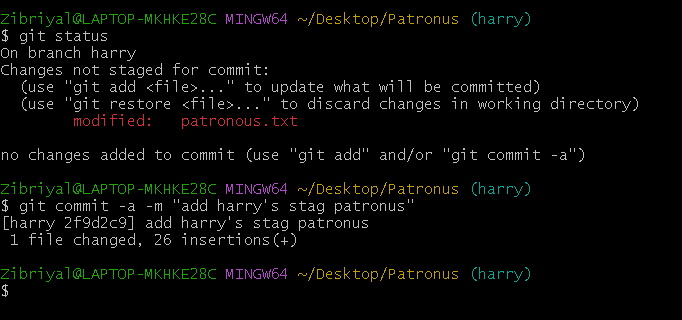

---

## 9. Move to the `snape` branch

Use the **older** Git command, `git checkout`, to change branches:

```bash
git checkout snape
```

Verify the current branch:

```bash
git branch
```

The `*` should appear next to `snape`.

**Screenshot:**

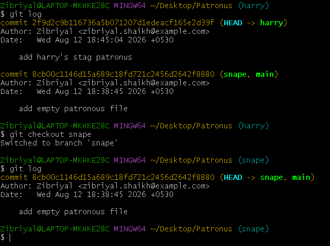

---

## 10. Add Snape's Patronus

Edit `patronus.txt` and replace the empty file with the required Snape content:

```text
SNAPE'S PATRONUS

<add the doe ASCII-art provided in the exercise>
```

Check the contents:

VSCODE

**Screenshot:**

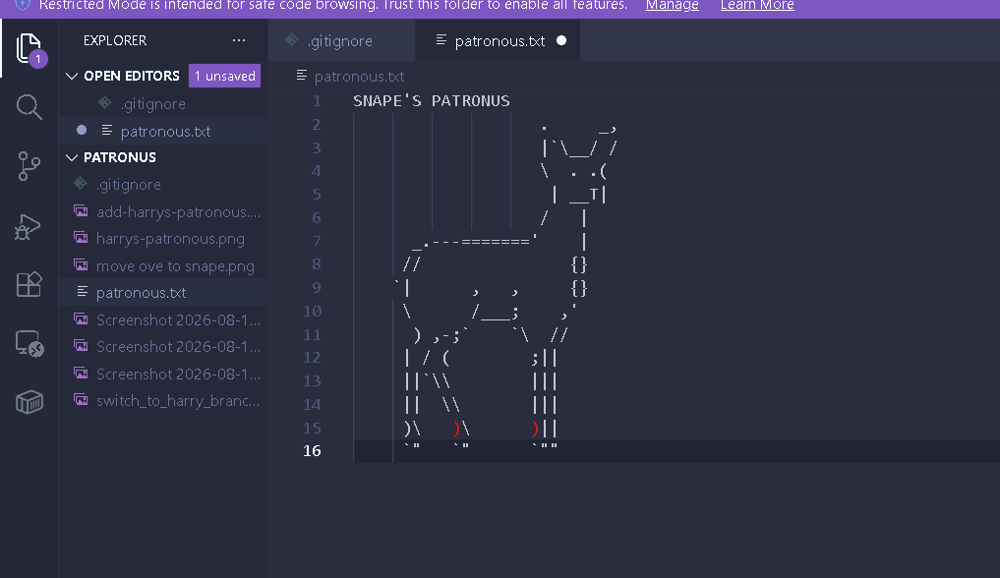

---

## 11. Commit Snape's changes

Stage the file:

```bash
git add patronus.txt
```

Commit the changes:

```bash
git commit -m "add snape's doe patronus"
```

**Screenshot:**

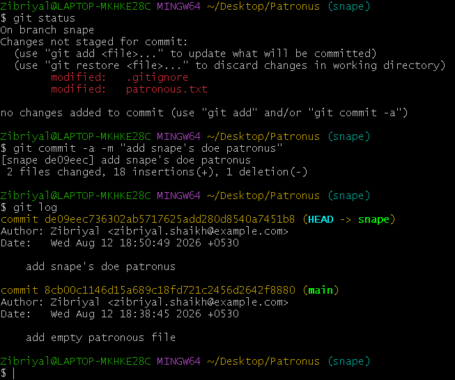

---

## 12. Create the `lily` branch from `snape`

The `snape` branch is currently checked out, so create `lily` from the current `snape` branch:

```bash
git branch lily
```


## 13. Move to the `lily` branch

Switch to the newly created `lily` branch:

```bash
git switch lily
```

Verify the current branch:

```bash
git branch
```

The `*` should appear next to `lily`.

**Screenshot:**

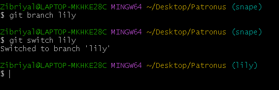

---

## 14. Change Snape's Patronus to Lily's

Edit `patronus.txt`.

Change:

```text
SNAPE'S PATRONUS
```

to:

```text
LILY'S PATRONUS
```

Keep the **doe ASCII-art unchanged**.

The final file should look like:

```text
LILY'S PATRONUS

<same doe ASCII-art>
```

**Screenshot:**

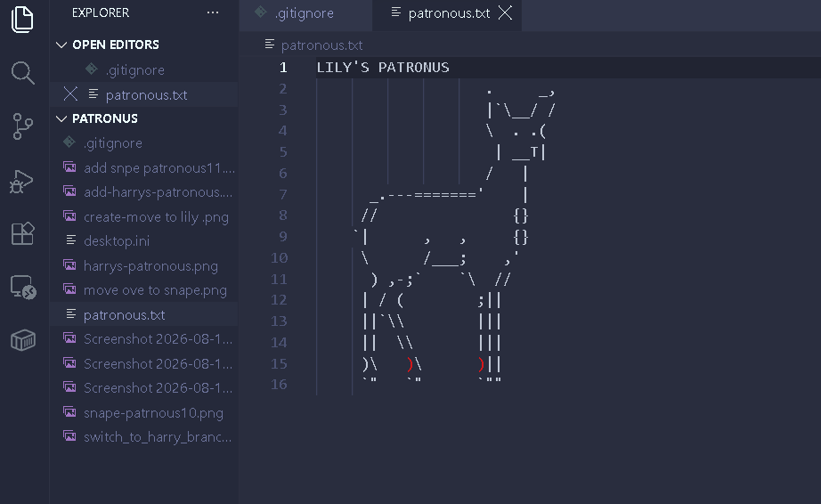

---

## 15. Commit Lily's changes

Stage the file:

```bash
git add patronus.txt
```

Commit the change:

```bash
git commit -m "add lily's doe patronus"
```

**Screenshot:**

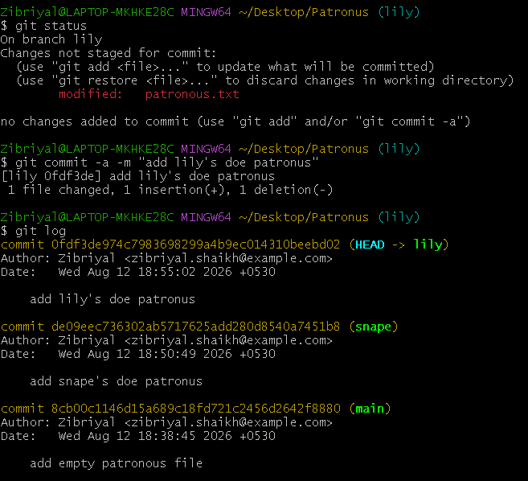

---

## 16. List all branches

Run the following command:

```bash
git branch
```

You should see four branches:

```text
* lily
  master
  harry
  snape
```

The order may be different, but there should be **4 branches** in total.

**Screenshot:**

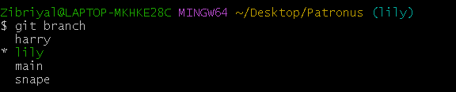

---

## 17. Bonus – Delete the `snape` branch

Poor Snape! 😄

First, make sure you are **not currently on the `snape` branch**. We are already on `lily`, so it is safe to delete it.

Delete the branch:

```bash
git branch -d snape
```

Verify the remaining branches:

```bash
git branch
```

You should now have:

```text
* lily
  master
  harry
```

**Screenshot:**

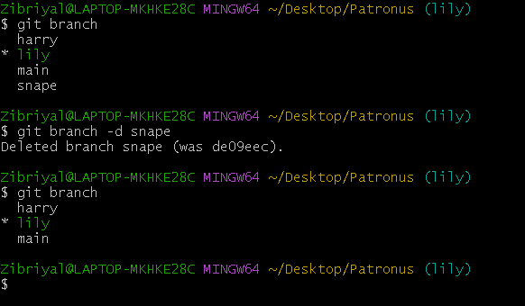

---

# Final Branch Structure

After completing the exercise, the branch history should conceptually look like this:

```text
master
  |
  |---- harry
  |       |
  |       └── add harry's stag patronus
  |
  └---- snape
          |
          └---- lily
                  |
                  └── add lily's doe patronus
```

After the bonus deletion, `snape` is removed, but `lily` keeps the commits it inherited from `snape`.

## Commands Used

| Purpose               | Command                       |
| --------------------- | ----------------------------- |
| Create folder         | `mkdir Patronus`              |
| Enter folder          | `cd Patronus`                 |
| Initialize repository | `git init`                    |
| Create empty file     | `touch patronus.txt`          |
| Stage file            | `git add patronus.txt`        |
| Commit changes        | `git commit -m "message"`     |
| Create branch         | `git branch <branch-name>`    |
| Switch branch – newer | `git switch <branch-name>`    |
| Switch branch – older | `git checkout <branch-name>`  |
| List branches         | `git branch`                  |
| Delete branch         | `git branch -d <branch-name>` |

## Exercise Completed

This exercise demonstrates:

* Creating a Git repository
* Creating and listing branches
* Switching branches using `git switch`
* Switching branches using `git checkout`
* Making independent changes on different branches
* Creating a branch from another branch
* Committing changes to individual branches
* Deleting a branch
