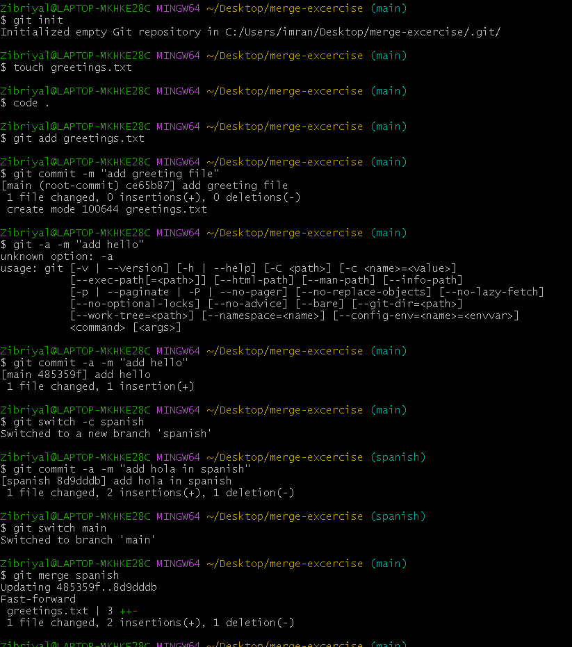
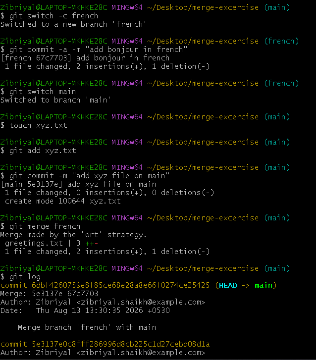

# Git Merge Exercise 03

This exercise is about practicing three different types of Git merges:

1. Fast-Forward Merge
2. Merge Commit — No Conflicts
3. Merge Conflict and Resolution

---

## Part 1 — Fast-Forward Merge

### Goal

Create a new branch, make changes, and merge it into `main` using a **Fast-Forward Merge**.

### Steps

* Created a new branch from `main`.
* Added changes to `greetings.txt`.
* Committed the changes.
* Switched back to `main`.
* Merged the new branch into `main`.

### Result

The merge was completed with a **Fast-Forward Merge**.

### Screenshot

---

## Part 2 — Merge Commit (No Conflicts)

### Goal

Create a new branch and make changes so that merging it into `main` creates a **merge commit** without any conflicts.

### Steps

* Created a new branch from `main`.
* Made changes to the repository.
* Committed the changes.
* Made another commit on `main`.
* Merged the new branch into `main`.
* Git created a merge commit without any conflicts.

### Result

The merge was completed successfully with **no conflicts**.

### Screenshot

---

## Part 3 — Merge Conflict

### Goal

Create a merge conflict and learn how to resolve it.

### Steps

* Created a new branch from `main`.
* Changed the same part of `greetings.txt` on the new branch.
* Committed the changes.
* Made a different change to the same part of `greetings.txt` on `main`.
* Tried to merge the branch into `main`.
* Git reported a **merge conflict**.
* Opened the file and chose the correct changes.
* Removed the conflict markers.
* Added and committed the resolved file.

### Result

The conflict was successfully resolved and the merge was completed.

---

## Final Result

| Part   | Merge Type     | Result         |
| ------ | -------------- | -------------- |
| Part 1 | Fast-Forward   | ✅ Successful   |
| Part 2 | Merge Commit   | ✅ No Conflicts |
| Part 3 | Merge Conflict | ✅ Resolved     |

## What I Practiced

* Creating branches
* Making commits
* Merging branches
* Creating a Fast-Forward Merge
* Creating a Merge Commit
* Finding and resolving a Merge Conflict

**Git Merge Exercise 03 — Completed ✅**
